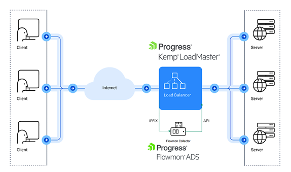
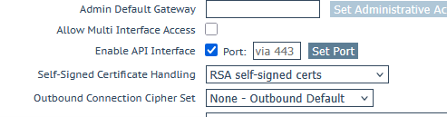
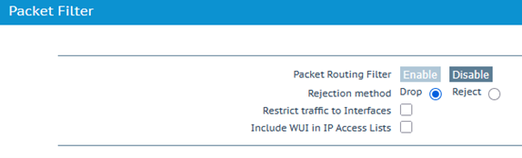
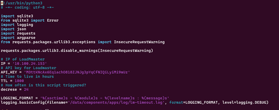

LoadMaster integration for input traffic blocking
=================================================

***Use-case***

Use case for this script integration is to block some input traffic by global or virtual server specific access list rule. To achieve it we have a script which does create a record in the access list. This is now designed to work only for IPv4 addresses.

These scripts were tested on Flowmon 12 with ADS 12.5 and LoadMaster 7.2.62 but they should work also on the older version. However, they might require some additional Python packages which aren’t available on the older versions. It’s recommended to use version 12.4 or newer.


### LoadMaster configuration

You would need to make sure API is enabled. How to do that is described at [LoadMaster API documentation](https://loadmasterapiv2.docs.progress.com/#intro).

Then you would need to create an API key for the user who can configure the LoadMaster to allow this integration to add access list rules.

Second thing is to make sure you have REST API enabled. To check this, go to:

1.  Certificate & Security
2.  Remote Access and make sure you have Enable API Interface ticked there
3.  Double check that in Admin WUI Access you have Session Management enabled


Third is to make sure that Packet Routing filter is enabled to allow us to work with it.

1.  System Configuration
2.  Network Setup
3.  Packet Routing Filter needs to be enabled so you have only option to disable it


### Script and Flowmon ADS configuration

This guide assumes that you have Flowmon ADS configured with active Data Feeds and basic tuning completed. More details about configuration of the Flowmon system are in the User guide, which is included in every Flowmon appliance, or alternatively at the following location: [https://docs.progress.com/](https://docs.progress.com/).

There are two scripts, first called **lm-block.py** is to be imported to Flowmon ADS and adds the IP address to the access list on LoadMaster to block the traffic to virtual service. The **lm-timeout.py** is the part responsible for removing after a certain time the record from the access list and thus from blocking.

The script for timeout can be placed to /home/flowmon/lm-mitigation/ directory and where it would by default place its database.

```
mkdir /home/flowmon/lm-mitigation/
```
If you wish to use a different directory you would need to modify the scripts and specify the location.

#### Cron configuration for the lm-timeout.py

There is a script prepared for removal of blocked IP addresses. On SSH console access you can run a command crontab -e to edit a cron table and add to the last line something like

```
# ACL block address removal
0 * * * * /home/flowmon/lm-mitigation/lm-timeout.py 2>&1
```

If you want to use a different schedule, then you can find some help on the first parameter [https://cron.help/every-hour](https://cron.help/every-hour)

You need to make sure that script is executable

```
[flowmon@localhost lm-mitigation\]$ ls -la
total 16
drwxrwxr-x 2 flowmon flowmon 4096 Dec 23 15:52 .
drwx------. 12 flowmon flowmon 4096 Dec 23 15:52 ..
-rwxrwxr-x 1 flowmon flowmon 5393 Dec 23 15:52 lm-timeout.py
```

If you don’t see the x at every position, you can make it executable by running command
```
chmod a+x /home/flowmon/lm-mitigation/lm-timeout.py
```
#### Script configuration

The script configuration is possible by changing the respective lines in the scripts

You can modify them directly on the Flowmon appliance using vim i.e. **vim /home/flowmon/lm-mitigation/lm-timout.py**



Where you need to set up an IP address or hostname for the LoadMaster device. Then API\_KEY created in LoadMaster to allow us to modify the Access List. Also, Time to live (TTL) and decrease could be changed if needed. Default is 1800 hours and to be decreased by 24 hours as the timeout script is to run every hour in this example.

This lm-timout.py script is there to keep a persistent database of blocked IPs and after certain remove blocked IPs.

It is not required for the main script of lm-mitigation.py to work but it will fail with error when it cannot be called so modification will be required, and you would need or you would need to modify the script not to call the lm-timeout.py.

Create Perspective(s)

Create one or more Perspectives to categorize anomalies on the network.

This guide gives an example only. In production, you must find what traffic your organization would like to enable alerts and triggers on.

1.  Within the ADS module, go to **Settings** > **Processing** > **Perspectives**.
2.  Click **\+ NEW PERSPECTIVE**.

a) Provide a **Name**.

b) Select the relevant **Filter**.

c) Select the relevant **Data feed**.

d) Select the priority (Critical, High, Medium, Low, and Informational) and add the relevant detection methods to each priority.

e) Click **SAVE**.

### Create a Custom Script (API trigger)

In Flowmon ADS, custom scripts are used to automate actions when anomalous events are detected according to the configured Perspective. Each custom script must be bound to exactly one Perspective. A script can be in the active or inactive state.

1.  Within the ADS Module, go to **Settings > System Settings > Custom scripts**.
2.  Click **\+ NEW CUSTOM SCRIPT**.
3.  Provide a **Name** for the script.
4.  Under **File**, click **Choose file** and select the custom script to trigger LoadMaster mitigation action.
5.  Click **SAVE**.
6.  Within the ADS Module, go to **Settings > Processing > Custom scripts**.
7.  Click **\+ NEW CUSTOM SCRIPT ACTION**.
8.  Provide a **Name** for the action.
9.   Select the **Perspective**.
10.  Tick the box to make the action **Active**.
11.  Set the **Minimum priority to be reported**.
12.  Click **SAVE**.

### Perspective Methods

Methods outlined within the perspectives shown are recommendations and should be adjusted as relevant to your network access details. Progress Flowmon engineers are available to assist with determining which methods should be leveraged and we recommend the testing of triggers to ensure all is working as expected before enabling the actions taken by this script in production.

As a good starting point leveraging the methods: SCANS, RANDOMDOMAIN, BPATTERNS, DICTATTACK, SSHDICT, RDPDICT, and BLACKLIST (BotnetActivities, MalwareDomains and BotnetDomains) will provide detection of hosts that are carrying out anomalous actions.
