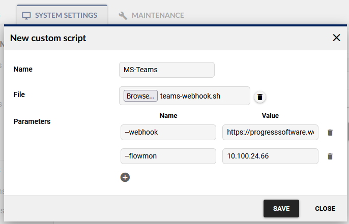
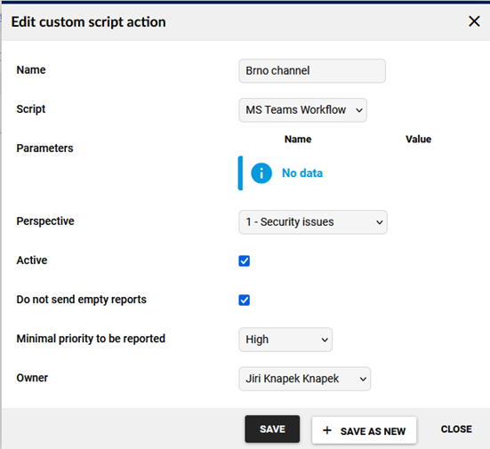
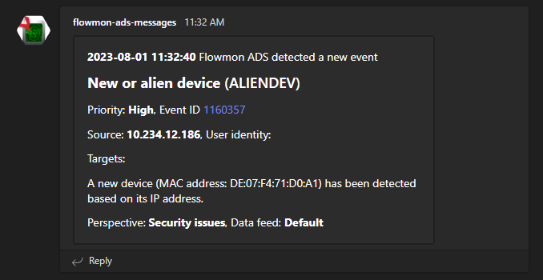
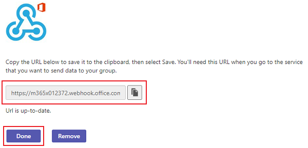

# Flowmon ADS Integration with Microsoft Teams

## Python Script — Teams Workflow Webhook (Recommended)

### Teams Configuration

Configure a Workflow-based webhook using the guide at:
<https://support.microsoft.com/en-us/office/create-incoming-webhooks-with-workflows-for-microsoft-teams-8ae491c7-0394-4861-ba59-055e33f75498>

Alternatively, you can set it up directly in Teams without opening a browser:

1. Right-click the channel where you want ADS notifications to appear and select **Workflows**.
2. Search for **Send a webhook alert to a channel** and select it.
3. Follow the prompts and copy the generated Webhook URL into the script.

### Flowmon ADS Configuration

This script has been tested with Flowmon ADS 12.5.2. It requires **Extended values** to be enabled in ADS and supports both standard ADS events and IDS events.

Details on configuring a custom script action are in the [User Guide](https://docs.progress.com/bundle/progress-flowmon-ads-13-0/page/topics/user-guide/Event-Response.html#custom-scripts) of Flowmon ADS.

You have two options for providing the Webhook URL and Flowmon hostname:

**Option 1 — Embed directly in the script** before uploading it to ADS (recommended, see note below):


**Option 2 — Pass as parameters** when configuring the action in the ADS UI:



Then configure the action where you can set or adjust the parameters:



> **Note:** The Workflow webhook URL typically exceeds 255 characters, which is the parameter value limit in the ADS UI. You must therefore embed the webhook URL directly in the script rather than passing it as a parameter. Avoid using online URL shorteners — the URL is sensitive and anyone who possesses it can post messages to your channel.

> **Note:** The Workflow-based webhook returns HTTP `202 Accepted` on success, unlike the older Office 365 connector which returned `200`. The script handles this correctly.

```
usage: teams-webhook.py [-h] [-f FLOWMON] [-w WEBHOOK] [-t] [-j]

options:
  -h, --help            show this help message and exit
  -f FLOWMON, --flowmon FLOWMON
                        IP address or URL of the local Flowmon appliance
  -w WEBHOOK, --webhook WEBHOOK
                        Microsoft Teams Webhook URL
  -t, --test            Send test message
  -j, --json            Use new JSON format
```

You can also test the script from any Linux machine using the `--test` flag. The resulting message in Teams looks like the image below:



### Known Limitations

- The Workflows app cannot post in private channels as a flow bot. It can post on behalf of a user, but this means the messages will not be visible to that user in a private chat.

---

## Bash Script — Legacy Incoming Webhook Connector

> **Note:** This script (`teams-webhook.sh`) uses the older Office 365 Incoming Webhook connector, which Microsoft is retiring. Use the Python script above for all new deployments.

### Teams Configuration

Configuration of the legacy Incoming Webhook connector is described at:
<https://learn.microsoft.com/en-us/microsoftteams/platform/webhooks-and-connectors/how-to/add-incoming-webhook>

Select a channel and add the connector there. The connector provides an HTTPS URL that the script will POST messages to.



Note that the legacy connector has strict rate limits: 4 messages per second, 60 per 30 seconds, and 100 per 5 minutes. Deploy this only for high-priority events or on a well-tuned Flowmon ADS system. Details:
<https://learn.microsoft.com/en-us/microsoftteams/platform/webhooks-and-connectors/how-to/connectors-using>

### Flowmon ADS Configuration

Details on configuring a custom script action are in the [User Guide](https://docs.progress.com/bundle/progress-flowmon-ads-12-5/page/topics/user-guide/Custom-Actions.html#custom-scripts) of Flowmon ADS.

You have two options for providing the parameters. You can set them directly in the script before uploading:


Or provide them as parameters after uploading, specifying the URL and your Flowmon web UI hostname or IP address.

> **Note:** The Webhook URL exceeds 255 characters, which is the parameter value limit in the ADS UI. You must embed the webhook URL directly in the script.

```
usage: teams-webhook.sh <options>

Optional:
  --webhook   MS Teams Webhook
  --flowmon   IP / Hostname of Flowmon Web UI for links
  --test      This will send a test message with static text
```

You can also test it from any Linux machine using the `--test` flag. The output in Teams looks like the image below:


