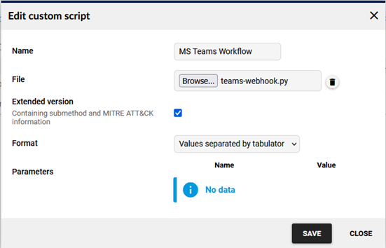
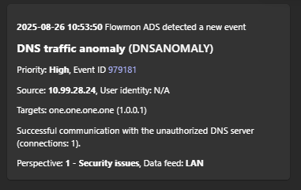

# Flowmon ADS Integration with Teams

## Microsoft Teams Workflow Script usage

Those steps are ment for the Python script teamw-webhook.py present in this directory.

### Teams Configuration

Configure incoming webhook as it is described at
<https://support.microsoft.com/en-us/office/create-incoming-webhooks-with-workflows-for-microsoft-teams-8ae491c7-0394-4861-ba59-055e33f75498>

You need to select which group it should be sent to and when you follow
the above guide it should get HTTP URL where the script will send (POST)
the message.

### **Flowmon ADS Configuration**

This script has been tested with Flowmon ADS 12.5.2 and expects the
Extended values to be enabled as well as you can use both formats. It
means you can use it to report on IDS events as well.

Details on how to configure a custom script are in the [User
Guide](https://docs.progress.com/bundle/progress-flowmon-ads-12-4/page/topics/user-guide/Custom-Actions.html#custom-scripts)
of the Flowmon ADS.

You have two options to provide the parameters in the script itself
before uploading.


Or to provide these by parameters when after uploading and specifying
the URL and your Flowmon web UI hostname or IP address.

However, with my test the URL is longer than 255 characters and that is
a limit of parameter value you can use in the UI. Thus, you must provide
the webhook URL in the script for this to work properly. The other
option would be to use some internal URL shortening but I would not
share it with some online ones as the URL is sensitive information and
anyone with it can use to for posting the data.

```
usage: teams-webhook.py [-h] [-f FLOWMON] [-w WEBHOOK] [-t] [-j]

options:

-h, \--help show this help message and exit
-f FLOWMON, \--flowmon FLOWMON IP address or URL of the local Flowmon appliance
-w WEBHOOK, \--webhook WEBHOOK Microsoft Teams Webhook URL
-t, \--test Send test message
-j, \--json Use new JSON format
```
For example, we can create a custom script with those parameters to be
different from default.



And then configure action if you are using the parameters you can modify
them there.


You can also test it from any Linux machine when you use parameter test.
The output in teams looks like in the image below.



There is one limitation I encountered

- Workflows app can\'t post in private channels as a flow bot. However,
  it can be posted on behalf of a user.

So, when you have a private chat you need to post as yourself which
makes the new messages invisible to you.

## These below lines are related to the original Bash shell script

Microsoft Teams Incoming Webhook Script Usage

**Teams Configuration**

Configuration of the Incoming webhook is described at
<https://learn.microsoft.com/en-us/microsoftteams/platform/webhooks-and-connectors/how-to/add-incoming-webhook>

You only need to select a group and add connector there. This webhook
will provide you with HTTPs URL where the script will send (POST) the
messages.


There is a limitation on how many messages could be sent through the
webhook. The details are available at
<https://learn.microsoft.com/en-us/microsoftteams/platform/webhooks-and-connectors/how-to/connectors-using>

Current numbers are four messages in a second and sixty in 30 seconds
and 100 in five minutes. So, this should be deployed only on the
important event or well configured Flowmon ADS system.
