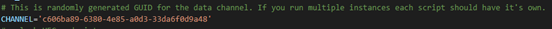

# Splunk HEC script usage

## Splunk configuration

The configuration of Splunk is described at
<https://docs.splunk.com/Documentation/Splunk/9.0.4/Data/UsetheHTTPEventCollector>

But basically, you need to add new HTTP Event Collector (HEC) data
source

This way you would obtain the Token needed for authentication. Then if
you run multiple instances of the script, you should change a CHANNEL
identification in the script

This is one randomly generated and needs to be unique so you can use a
service like <https://www.uuidgenerator.net/version4> to get one in
correct format.

Once everything is correct you should receive these as httpevent

Parsing those isn’t part of this document but this is something expected
to be known to the Splunk administrators.

## Flowmon ADS configuration

Details how to configure a custom script are at [User Guide](https://docs.progress.com/bundle/progress-flowmon-ads-12-4/page/topics/user-guide/Custom-Actions.html#custom-scripts) of the Flowmon ADS.

You can provide server name and authentication token in the script
itself

Or provide these by parameters.

	usage: hec-event.sh <options>
	Optional:

	--srv	IP / hostname<:port> of Splunk server
	--key	Splunk HEC token

The default HEC port is 8088 so unless you changed it don’t forget to
keep it there.

This script was tested against Free Cloud instance of Splunk version 9
but should work with any version of Splunk which supports HEC.
